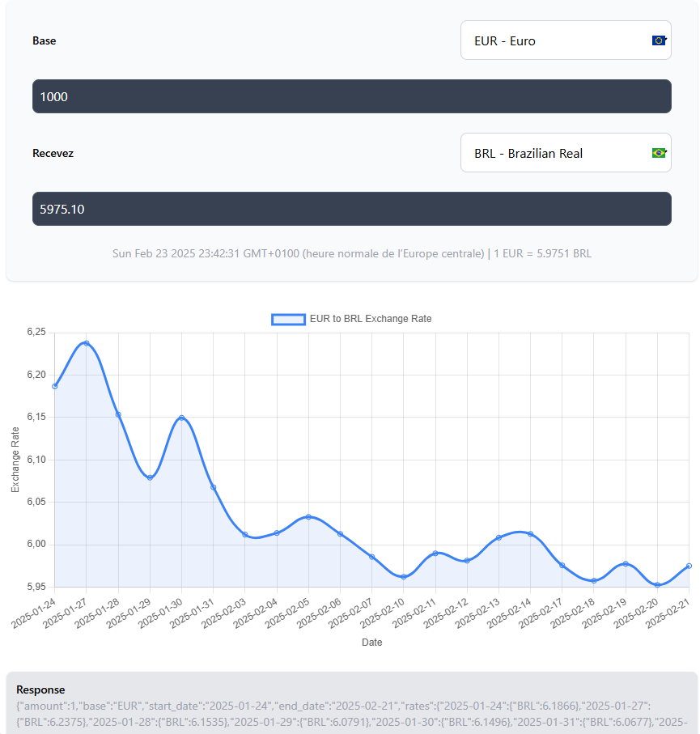

# Currency Converter Web Page


## Overview
A free and simple currency converter web application that allows users to calculate exchange rates dynamically using real-time data. This static web application fetches exchange rates from the Frankfurter API and displays historical exchange trends in an interactive chart.

## Features
- 📌 **Real-time exchange rates** using the [Frankfurter API](https://www.frankfurter.app/)
- 📊 **Interactive exchange rate chart** powered by Chart.js
- 🌍 **Support for multiple currencies** with automatic country flag display
- 🖥️ **Fully responsive design** using Tailwind CSS

## Technologies Used
- **HTML, CSS, JavaScript** (Frontend development)
- **Tailwind CSS** (Styling framework)
- **Chart.js** (Data visualization)
- **Frankfurter API** (Currency exchange rate provider)

## Installation & Usage
This project is a static webpage and does not require any installation. You can simply clone the repository and open `index.html` in your browser.

### Clone Repository
```sh
git clone https://github.com/YuetongLU7/WebSemaine_Diogo_Yuetong.git
cd WebSemaine_Diogo_Yuetong
```

### Open Locally
Open `index.html` in your browser:
```sh
open index.html
```
Or if you are using a local server:
```sh
python -m http.server 8000  # Python 3
```
Then visit `http://localhost:8000` in your browser.

## API Integration
The exchange rates are fetched from the Frankfurter API. The API call format:
```js
fetch(`https://api.frankfurter.app/latest?base=USD&symbols=EUR,GBP,JPY`)
  .then(response => response.json())
  .then(data => console.log(data));
```

## Example Screenshot


## License
This project is open-source and free to use under the MIT License.

---
💡 **Contributions are welcome!** 
All the packages are routed trough the CDN of npm, which can cause errors if for some reason is out of service.

If you find any issues or want to improve the project, feel free to open a pull request.

